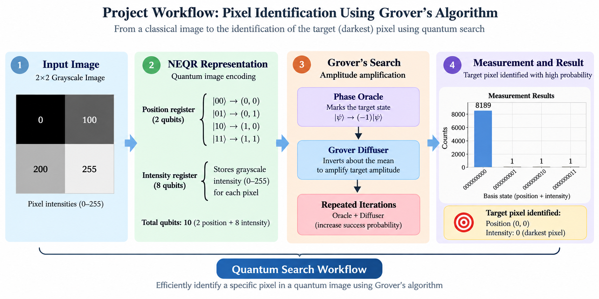

[](https://pixel-identification-in-an-image-us.vercel.app/)

[](https://pixel-identification-in-an-image-us.vercel.app/)

##  Project Workflow



# Pixel Identification in an Image Using Grover's Algorithm

A Master's thesis project exploring the application of **Grover's quantum search algorithm** to pixel identification in grayscale images, using quantum image representation and quantum circuit simulation.

##  Interactive Demonstration

Explore an interactive visualization of my Master's thesis project. The tool demonstrates:

- NEQR quantum image representation
- Position and intensity registers
- Controlled encoding using CCX (Toffoli) gates
- Grover's phase oracle
- Grover's diffuser
- Amplitude amplification
- Final quantum measurement

### 🔗 Live Demo

**[▶ Launch the Interactive Grover Demonstration](https://pixel-identification-in-an-image-us.vercel.app/)**

> The interactive tool is designed as an educational companion to the thesis, allowing students to explore how a classical 2×2 grayscale image is represented and searched using quantum computing concepts.

## About the Project

This project investigates how quantum search techniques can be used to identify and locate a target pixel within a grayscale image.

The thesis explores **NEQR (Novel Enhanced Quantum Representation)** for representing pixel position and intensity, followed by Grover's algorithm for quantum search.

The project combines concepts from:

- Quantum computing
- Grover's search algorithm
- Quantum image processing
- NEQR
- Image processing
- Quantum circuit simulation

## Project Objective

The primary objective of this project is to explore the use of Grover's quantum search algorithm for identifying a particular pixel in a grayscale image.

The thesis demonstrates the approach using a small grayscale image and quantum circuit simulations.

## Quantum Image Representation

The project uses **NEQR (Novel Enhanced Quantum Representation)** to represent image information.

For the 2 × 2 example considered in the thesis:

- **2 qubits** represent the pixel position.
- **8 qubits** represent the grayscale intensity.
- A total of **10 qubits** are used for the image representation.

The four pixels are represented as:

| Pixel Position | Grayscale Value | Binary Intensity |
|---|---:|---|
| `(0,0)` | 0 | `00000000` |
| `(0,1)` | 100 | `01100100` |
| `(1,0)` | 200 | `11001000` |
| `(1,1)` | 255 | `11111111` |

The darkest pixel in this example is the pixel at `(0,0)`, with intensity `0`.

## Project Workflow

The project follows these main steps:

1. **Create a grayscale image**
   - A 2 × 2 grayscale image is used as the test image.

2. **Represent the image using NEQR**
   - Pixel positions are represented using 2 qubits.
   - Pixel intensities are represented using 8 qubits.

3. **Construct the Grover oracle**
   - The oracle marks the target quantum state.

4. **Apply amplitude amplification**
   - The Grover diffuser amplifies the probability of the marked state.

5. **Measure the quantum circuit**
   - The circuit is executed using a quantum circuit simulator.

6. **Analyze the measurement results**
   - The resulting measurement distribution is examined to determine how strongly the marked state is amplified.

## Grover's Algorithm

Grover's algorithm is used as a quantum search procedure to identify a marked state.

The implementation includes:

1. Preparation of the quantum state.
2. Construction of a phase oracle.
3. Construction of the Grover diffuser.
4. Repeated Grover iterations.
5. Measurement of the quantum register.
6. Analysis of the resulting measurement distribution.

## Implementations

The repository contains both the original implementations associated with the Master's thesis and a modernized Qiskit implementation.

### Original Implementations

The original implementations are preserved under:

```text
code/original/
```

They include:

- `qiskit_neqr.py` — NEQR image encoding
- `qiskit_grover.py` — Grover circuit implementation
- `cirq_grover.py` — Cirq-based Grover implementation

### Qiskit

The Qiskit implementation includes:

- NEQR image encoding
- Quantum circuit construction
- Grover oracle
- Grover diffuser
- Quantum circuit simulation

### Cirq

The Cirq implementation demonstrates Grover's algorithm for identifying the minimum-intensity (darkest) pixel in a randomly generated 2 × 2 grayscale image.

## Modern Implementation

The repository also includes a modern Qiskit implementation:

```text
code/modern/grover_pixel_search.py
```

This implementation uses current Qiskit and Qiskit Aer APIs to demonstrate Grover's search on a 10-qubit system.

For the 2 × 2 example, the marked target state is:

```text
0000000000
```

which corresponds to:

```text
Position:  (0,0)
Intensity: 0
```

The implementation performs the following steps:

1. Creates the 2 × 2 grayscale example.
2. Constructs a Grover phase oracle.
3. Constructs the Grover diffuser.
4. Applies amplitude amplification.
5. Simulates the circuit using Qiskit Aer.
6. Measures the quantum state.
7. Visualizes the measurement distribution.

> **Note:** The current modern implementation demonstrates Grover's search for the known target state in this specific 2 × 2 example. It is not a general-purpose algorithm that automatically finds the darkest pixel of an arbitrary image.

## Results


## 📊 Key Results

- **Input image:** 2×2 grayscale image with pixel intensities 0, 100, 200, and 255.
- **Image representation:** NEQR, using 2 position qubits and 8 intensity qubits.
- **Total qubits:** 10 for the combined position and intensity representation.
- **Search target:** The darkest pixel, with intensity 0, at position (0,0).
- **Grover simulation:** The target bitstring `0000000000` was measured 8,183 times in 8,192 shots in the recorded run (approximately 99.89%).

These results demonstrate the small-scale example. They do not establish a practical quantum advantage or a complete quantum minimum-finding implementation.

### Input Image

The experiment uses the following 2 × 2 grayscale image:

```text
[[  0, 100],
 [200, 255]]
```

The darkest pixel has intensity `0` and is located at position `(0,0)`.


### Grover Search

Grover's algorithm was used to search for the marked state corresponding to the darkest pixel.

The target state is:

```text
0000000000
```

which corresponds to:

```text
Position:  (0,0)
Intensity: 0
```

Using **8192 measurement shots**, the target state was observed **8183 times**, giving a success probability of approximately **99.89%**.


The result demonstrates strong amplitude amplification of the marked quantum state.

### Conclusion

The simulation successfully recovered the marked quantum state corresponding to the darkest pixel in the 2 × 2 grayscale image:

```text
Position:  (0,0)
Intensity: 0
```

## Repository Structure

```text
.
├── README.md
├── CITATION.cff
├── requirements.txt
│
├── code/
│   ├── modern/
│   │   └── grover_pixel_search.py
│   │
│   └── original/
│       ├── qiskit_neqr.py
│       ├── qiskit_grover.py
│       └── cirq_grover.py
│
├── results/
│   ├── README.md
│   ├── original_2x2_image.png
│   └── grover_histogram.png
│
└── thesis/
    └── Final project thesis.pdf
```

## How to Run

### 1. Clone the repository

```bash
git clone https://github.com/Hussain000001/Pixel-identification-in-an-image-using-Grover-s-algorithm.git
cd Pixel-identification-in-an-image-using-Grover-s-algorithm
```

### 2. Install the required packages

```bash
pip install -r requirements.txt
```

### 3. Run the modern implementation

```bash
python code/modern/grover_pixel_search.py
```

The program creates the 2 × 2 grayscale example, constructs the Grover circuit, runs the simulation using Qiskit Aer, prints the measurement results and success probability, and displays the measurement histogram.

## Requirements

- Python 3.x
- Qiskit
- Qiskit Aer
- NumPy
- Matplotlib

## Thesis

This repository is based on the Master's thesis:

**"Pixel identification in an image using Grover's algorithm"**

**Author:** Mohd Hussain Mir  
**Degree:** Master of Science in Physics  
**Institution:** National Institute of Technology Srinagar  
**Supervisor:** Dr. Harkirat Singh

The complete thesis is available in the [`thesis/`](thesis/) directory.

## 🔬 Research Limitations and Future Work

### Current Limitations

- The demonstration uses a small 2×2 grayscale image to explain quantum image representation and Grover's search.
- The current interactive implementation uses a predefined target state; it does not implement a complete quantum minimum-finding algorithm.
- The educational simulation illustrates the concepts and does not establish a practical quantum advantage for image processing.
- The results depend on the circuit implementation and simulation settings.

### Future Work

- Extend the implementation to larger grayscale images.
- Investigate reversible comparison circuits for encoding minimum-intensity search into a quantum oracle.
- Explore quantum minimum-finding algorithms that reduce dependence on classical preprocessing.
- Evaluate circuit depth, gate count, measurement statistics, and noise on quantum hardware.
- Compare the quantum approach with classical pixel-search methods.

## Citation

If you use this project or the associated thesis in your work, please cite it using the information provided in [`CITATION.cff`](CITATION.cff).
