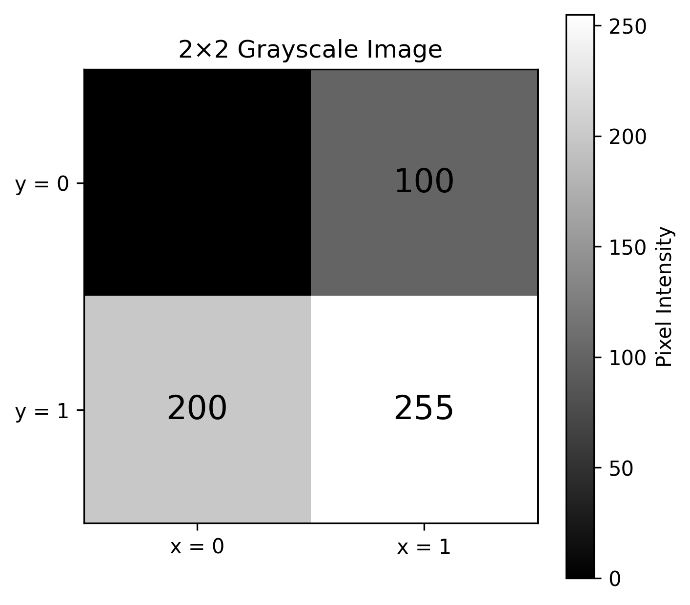
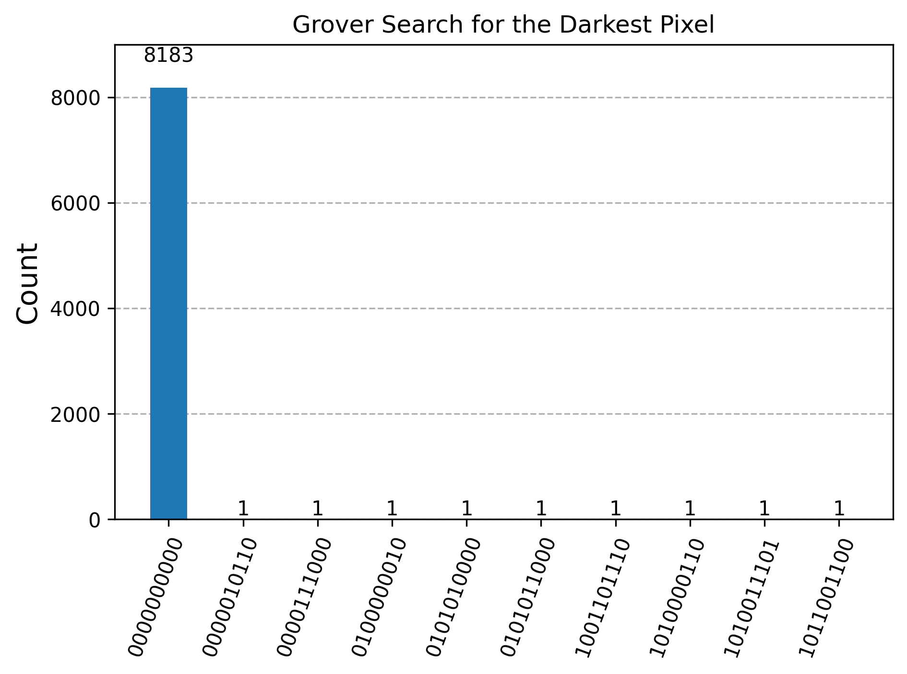

# Pixel Identification in an Image Using Grover's Algorithm

A Master's thesis project exploring the application of **Grover's quantum search algorithm** to pixel identification in grayscale images, using quantum image representation and quantum circuit simulation.

## About the Project

This project investigates how quantum search techniques can be used to identify and locate a target pixel within a grayscale image.

The thesis explores **NEQR (Novel Enhanced Quantum Representation)** for representing pixel position and intensity, followed by Grover's algorithm for quantum search.

The project combines concepts from:

- Quantum computing
- Grover's search algorithm
- Quantum image processing
- NEQR
- Image processing
- Quantum circuit simulation

## Project Objective

The primary objective of this project is to explore the use of Grover's quantum search algorithm for identifying a particular pixel in a grayscale image.

The thesis demonstrates the approach using a small grayscale image and quantum circuit simulations.
## Results

## Input Image

The experiment uses the following 2 × 2 grayscale image:

```text
[[  0, 100],
 [200, 255]]



## Quantum Image Representation

The project uses **NEQR (Novel Enhanced Quantum Representation)** to represent image information.

For the 2 × 2 example considered in the thesis:

- **2 qubits** represent the pixel position.
- **8 qubits** represent the grayscale intensity.
- A total of **10 qubits** are used for the image representation.

The four pixels are represented as:

| Pixel Position | Grayscale Value | Binary Intensity |
|---|---:|---|
| `(0,0)` | 0 | `00000000` |
| `(0,1)` | 100 | `01100100` |
| `(1,0)` | 200 | `11001000` |
| `(1,1)` | 255 | `11111111` |

The darkest pixel in this example is the pixel at `(0,0)`, with intensity `0`.

## Project Workflow

The project follows these main steps:

1. **Create a grayscale image**
   - A 2 × 2 grayscale image is used as the test image.

2. **Represent the image using NEQR**
   - Pixel positions are represented using 2 qubits.
   - Pixel intensities are represented using 8 qubits.

3. **Construct the Grover oracle**
   - The oracle marks the target quantum state.

4. **Apply amplitude amplification**
   - The Grover diffuser amplifies the probability of the marked state.

5. **Measure the quantum circuit**
   - The circuit is executed using a quantum circuit simulator.

6. **Analyze the measurement results**
   - The resulting measurement distribution is examined to determine how strongly the marked state is amplified.

## Grover's Algorithm

Grover's algorithm is used as a quantum search procedure to identify a marked state.

The implementation includes:

1. Preparation of the quantum state.
2. Construction of a phase oracle.
3. Construction of the Grover diffuser.
4. Repeated Grover iterations.
5. Measurement of the quantum register.
6. Analysis of the resulting measurement distribution.



## Implementations

The repository contains both the original implementations associated with the Master's thesis and a modernized Qiskit implementation.


### Original Implementations

The original implementations are preserved under:

```text
code/original/
